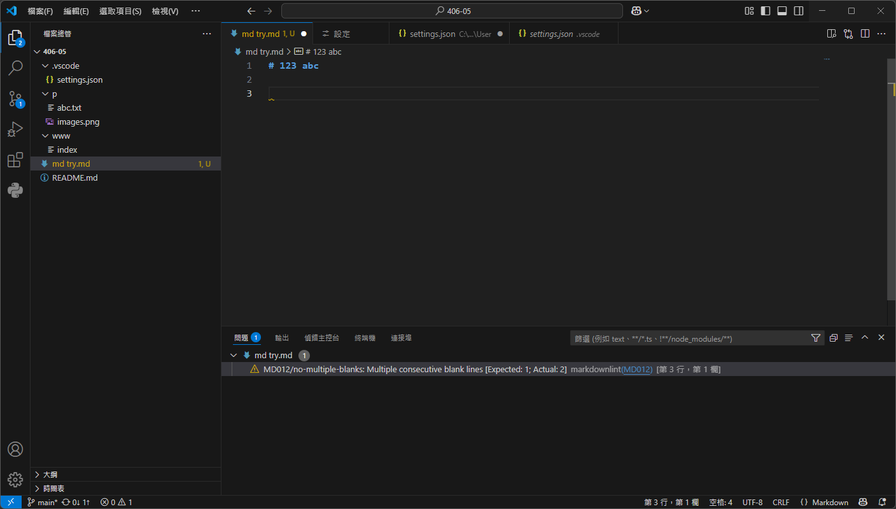

# 123 abc

---




123
**B**

---

- L
- 2
I123
~I123~

1. ~~123~~
    - 888
2. _~I123~_
    - **7**

```html
<!--
THE #
-->
<head>
    <title>try</title>
</head>
<body>
    <center>
    <h>used 4</h>
    </center>
</body>
```

```ruby
puts "Hello, world!"
x = gets
[1,2,3,4].each do |e|
    print "#{e} + #{x}"
end
```

```python
class mate:
    def __init__(self):
        pass
x = int(input("x:"))
print f"{x}+8"
```

> 87

-# 888

````ruby
#8
sprintf('name: %s; num: %d', 'test', 0) # => "name: test; num: 0"
````

````html
<!DOCTYPE html>
<html lang="zh-Hant-TW">
<head>
    <meta charset="UTF-8">
    <title>title</title>
</head>
<body>
<h1>h</h1>
</body>
</html>
````

\!\
[123\](123\)

[show gulugulu](www.google.com)
[首頁](www/index)
